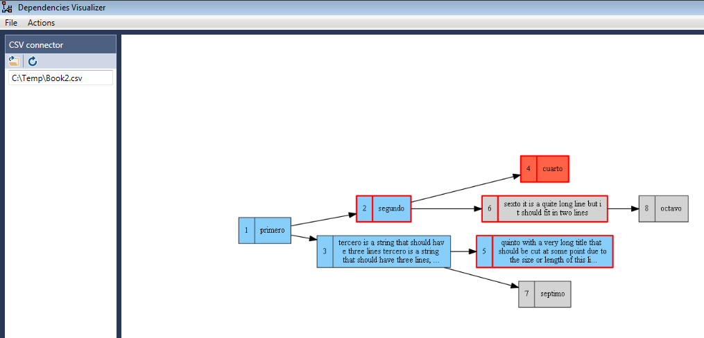

# depviz
Item dependency visualization tool, based on [Graphviz](https://www.graphviz.org/).

## Full description
Tool that allows a graphical visualization of dependencies between items (i.g. nodes on a directed graph) using [Graphviz](https://www.graphviz.org/), without the need of using the [Dot language](https://www.graphviz.org/doc/info/lang.html).

**TFS:** 
**CSV:** 

## How it does it?
The tool uses different (currently **TFS** and **CSV**) repositories in order to obtain the **Items** (nodes), its **Successors**, **States** and **Tags**.

* **Items**: the "box" with its ID and Title.
* **Succesors**: the successor (connected with an arrow) "box"
* **States**: possible states (the default are the TFS ones: _New_, _Approved_, _Committed_, _In Progress_ and _Done_. These are used to color the "box"
* **Tags**: item tags. These are used to change the line/color of the line "box"

# Getting Started

## Prerequisites
* Windows 7 or 10
* Install [Graphviz](https://graphviz.gitlab.io/download/)
   * Annotate the binaries installation path (i.g. C:\Program Files (x86)\Graphviz2.38\bin)

## Installation
1. [Download the binaries](https://github.com/roberlamerma/depviz/releases/download/v0.2.0/Depviz_v0.2.0.zip)
1. Or build the tool yourself

## Configuration
1. Start the tool. You will be prompted for the Graphviz path (select the path 'bin', which is where the binaries that the tool uses are located)
1. Depending on the repository/connector you will use (TFS, CSV, ...), follow the instructions below:

### TFS
1. Open the tool
1. File -> Select Connector... -> TFS
1. Configure TFS: 
   1. _(You could also go to: File -> Configure (TFS))_
   1. Add your TFS **uri** (i.g. http://yourtfs:8080/tfs/defaultcollection) and the **project name** you want to connect to.

### CSV
1. Open the tool
1. File -> Select Connector... -> CSV
1. Select CSV file: 

# Add support for other repositories
:construction: _You could write your own "connector" (and connect the tool with [Jira](https://www.atlassian.com/software/jira), for example). Contact me if you have doubts how to do this.
